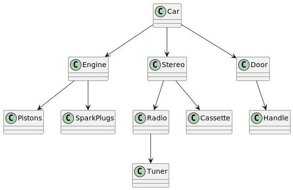
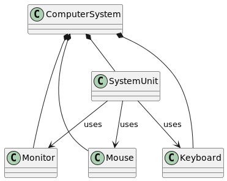
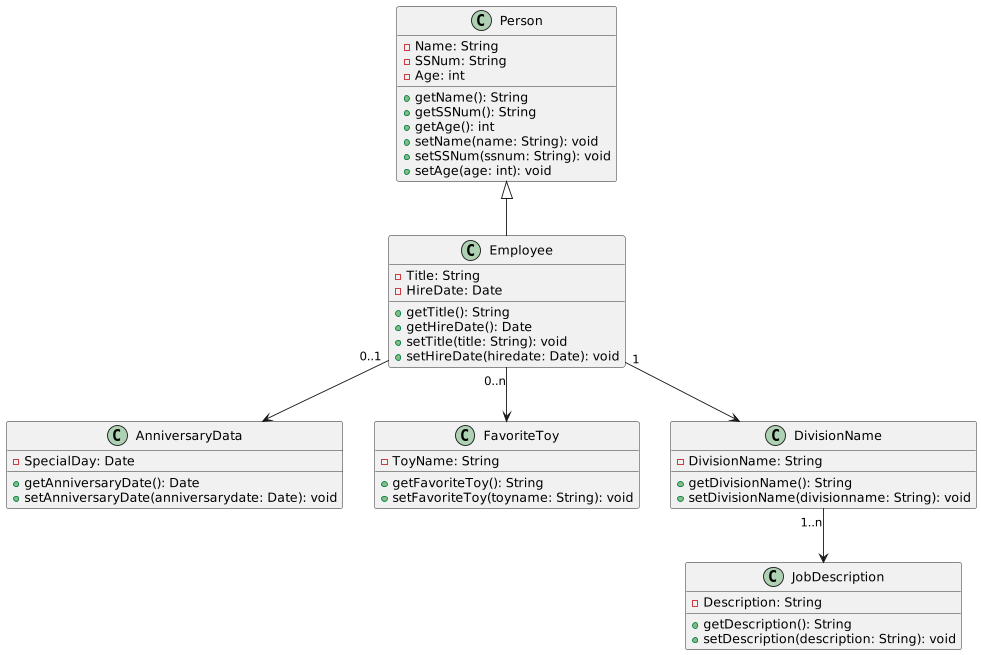
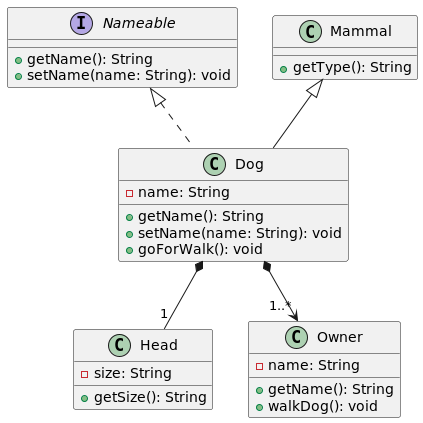

# Building Objects and Object-Oriented Design

<!-- TOC -->
* [Building Objects and Object-Oriented Design](#building-objects-and-object-oriented-design)
  * [Composition Relationships](#composition-relationships)
  * [Building In Phases](#building-in-phases)
  * [Types Of Composition](#types-of-composition)
    * [Aggregation](#aggregation)
    * [Association](#association)
    * [Using Associations and Aggregations Together](#using-associations-and-aggregations-together)
  * [Avoiding Dependencies](#avoiding-dependencies)
  * [Cardinality](#cardinality)
    * [Example: Employee Class Composition Cardinality Relationships](#example-employee-class-composition-cardinality-relationships)
      * [What do these classes do? Are they optional? How many does an Employee need?](#what-do-these-classes-do-are-they-optional-how-many-does-an-employee-need)
        * [Division](#division)
        * [JobDescription](#jobdescription)
        * [Spouse](#spouse)
        * [Child](#child)
      * [Inheritance](#inheritance)
      * [Composition Cardinality](#composition-cardinality)
    * [Multiple Object Associations](#multiple-object-associations)
<!-- TOC -->

There is a major difference between inheritance and composition. Although they allow us to have a relationship between a child and a parent, the two are inherently not the same.

Although it is true that inheritance is a relationship between two classes, what is really happening is that a parent is created that incorporates the attributes and methods of a child class.However, composition is a different situation. Composition represents interactions between distinct objects.

This chapter focuses on how composition is different from inheritance.

## Composition Relationships

We have already seen that composition represents a part of a whole. Although the inheritance relationship is stated in terms of is-a, composition is stated in terms of has-a. We know intuitively that a car “has-a” steering wheel.

The reason to use composition is that it builds systems by combining less complex parts. This is a common way for people to approach problems. Studies show that even the best of us can keep, at most, seven chunks of data in our short-term memory at one time. Thus, we like to use abstract concepts. Instead of saying that we have a large unit with a steering wheel, four tires, an engine, and so on, we say that we have a car. This makes it easier for us to communicate and keep things clear in our heads.

Composition also helps in other ways, such as making parts interchangeable. If all steering wheels are the same, it does not matter which specific steering wheel is installed in a specific car. In software development, interchangeable parts mean **reuse**.

## Building In Phases

Another major advantage in using composition is that systems and subsystems can be built independently, and perhaps more importantly, tested and maintained independently.

To build quality software, you must follow one overriding rule to be successful: Keep things as simple as possible. For large software systems to work properly and be easily maintained, they must be broken into smaller, more manageable parts.

**The architecture of complexity, by Nobel Prize winner Herbert Simon, states that:**

1. Stable complex systems usually take the form of a hierarchy, where each system is built from simpler subsystems, and each subsystem is built from simpler subsystems still.
2. Stable, complex systems are nearly decomposable. Meaning you can identify the parts that make up the system and can tell the difference between interactions between the parts and inside the parts.
3. Stable complex systems are almost always composed of only a few different kinds of subsystems, arranged in different combinations.
4. Stable systems that work have almost always evolved from simple systems
   that worked.

The above is 4 rules of building complex systems, and composition is just these 4 rules. Here is an analogy.

Let's say we have a stereo system. Suppose the stereo system was totally integrated and was not built from components (that is, the stereo system was one big black-box system). In this case, what would happen if the CD player broke and became unusable? You would have to take in the entire system for repair, or if not reparable throw it away. Not only would this be more complicated and expensive, but you would not have the use of any of the other components.

Suppose the system is broken into components rather than a single unit and connected together with wires. In this case, if the CD player broke, you could disconnect the CD player and take it in for repair. (Note that all the components are connected by wires, it's just a matter of connecting and disconnecting).

The above illustration shows clearly that composition is one of the primary strategies that you, as a software designer, have in your arsenal to fight software complexity.

## Types Of Composition

Generally, there are two types of composition: association and aggregation. In both cases, these relationships represent collaborations between the objects. The stereo example we just used to explain one of the primary advantages of composition represents an association.

All forms of composition include a has-a relationship. However, subtle differences exist between associations and aggregations based on how you visualize the parts of the whole. In an aggregation, you normally see only the whole, and in associations, you normally see the parts that make up the whole.

### Aggregation

Aggregation means that a complex object is composed of other objects. 

Let's see an analogy, when you go to buy a car, you do not pick and choose all the individual components of the car. You do not decide which spark plugs to buy or which door handles to buy. You go to buy a car. You choose the car as a whole, a complex object made up of many other complex and simple objects.



### Association

Whereas aggregations represent relationships where you normally see only the whole, associations present both the whole and the parts.

As stated in the stereo example above, the various components are presented separately and connect to the whole by use of patch cords (the cords that connect the various components).

Consider a traditional desktop computer system as an example; the whole is the computer system. The components are the monitor, keyboard, mouse, and the system unit. Each is a separate object, but together they represent the whole of the computer system. The main computer system is using the keyboard, the mouse, and the monitor to delegate some of the work. In other words, the system unit needs the service of a mouse but does not have the capability to provide this service by itself. Thus, the system unit requests the service from a separate mouse via the specific port and cable connecting the mouse to the system unit.



> **Aggregation vs Association:** An aggregation is a complex object composed of other objects. An association is used when one object wants another object to perform a service for it.

### Using Associations and Aggregations Together

One thing you might have noticed in all the examples is that the dividing lines between what is an association and what is an aggregation are often blurred. Suffice it to say that many of your most interesting design decisions both use aggregation and association.

For example, the desktop computer system example used to describe associations also contains some aggregation. Although the interaction between the system unit, the monitor, the keyboard, and the mouse is association, the system unit itself represents aggregation. You see only the system unit, but it is actually a complex system made up of other objects, including chips, motherboards, video cards, and so on.

## Avoiding Dependencies

When using composition, it is desirable to avoid making objects highly dependent on one another. One way to make objects very dependent on each other is to mix domains. In the best of all worlds, an object in one domain should not be mixed with an object in another domain, except under certain circumstances. We can return again to the stereo example to explain this concept.

By keeping all the components in separate domains, the stereo system is easier to maintain. For example, if the CD component breaks, you can send the CD player off to be repaired individually. In this case, the CD player and the MP3 player have separate domains. This provides flexibility, such as buying the CD player and the MP3 player from separate manufacturers. So, if you decide you want to swap out the CD player with a brand from another manufacturer, you can, maybe because they have a standardized interface.

Interfaces solve this dependency issue and managing dependencies is a major part of this. If interfaces are defined in a shared library and implementations are defined in more concrete classes, you can afford to mix domains by using the behavior contracts.

## Cardinality

Cardinality refers to the number of instances of one class that can be associated with a single instance of another class. It defines the numerical relationship between the classes involved in the composition.

Understanding cardinality in composition is important for several reasons:

1. **Clarity in Design**: Cardinality helps in clearly defining the relationships between different components of a system. It specifies how many instances of one class can be associated with another, which is crucial for accurate system modeling.

2. **Resource Management**: Knowing the cardinality helps in managing resources effectively. For example, if a `ComputerSystem` can have multiple `Monitors`, you need to ensure that the system can handle multiple monitor connections.

3. **Error Prevention**: By defining cardinality, you can prevent errors in system design. For instance, if a `MainBox` must have exactly one `Keyboard`, the system can enforce this rule, preventing scenarios where a `MainBox` might be left without a `Keyboard`.

4. **Communication**: Cardinality provides a clear way to communicate the structure and constraints of a system to other developers, stakeholders, and team members. It ensures everyone has a common understanding of how the system components interact.

5. **Scalability and Flexibility**: Understanding cardinality allows for better planning of system scalability and flexibility. For example, knowing that a `ComputerSystem` can have multiple `Mice` might influence design decisions to support various input devices.

### Example: Employee Class Composition Cardinality Relationships

For example, let’s consider the following scenario. We are creating an `Employee` class that inherits from `Person` and has relationships with the following classes:

- **Division**
- **JobDescription**
- **Spouse**
- **Child**

#### What do these classes do? Are they optional? How many does an Employee need?

##### Division
- This object contains the information relating to the division that the employee works for.
- Each employee must work for a division, so the relationship is mandatory.
- The employee works for one, and only one, division.

##### JobDescription
- This object contains a job description, most likely containing information such as salary grade and salary range.
- Each employee must have a job description, so the relationship is mandatory.
- The employee can hold various jobs during their tenure at a company. Thus, an employee can have many job descriptions. These descriptions can be kept as a history if an employee changes jobs, or it is possible that an employee might hold two different jobs at one time. For example, a supervisor might take on an employee’s responsibilities if the employee quits and a replacement has not yet been hired.

##### Spouse
- In this simplistic example, the `Spouse` class contains only the anniversary date.
- An employee can be married or not married. Thus, a spouse is optional.
- An employee can have only one spouse.

##### Child
- In this simple example, the `Child` class contains only the string `FavoriteToy`.
- An employee can have children or not have children.
- An employee can have no children or an infinite number of children (wow!). You could make a design decision as to the upper limit of the number of children that the system can handle.

The below table explains this well:

| Optional/Association | Cardinality | Mandatory |
|----------------------|-------------|-----------|
| Employee/Division    | 1           | Mandatory |
| Employee/JobDescription | 1..n      | Mandatory |
| Employee/Spouse      | 0..1        | Optional  |
| Employee/Child       | 0..n        | Optional  |

> **Cardinality Notation:**
The notation of 0 . . 1 means that an employee can have either zero or one spouse. The notation of 0 . . n
means that an employee can have any number of children from zero to an unlimited number.
The n basically represents infinity.



#### Inheritance
- **Person <|-- Employee**
   - The `Employee` class inherits from the `Person` class.
   - This means that `Employee` is a subclass of `Person` and will inherit all attributes and methods of the `Person` class.
   - Inheritance is depicted using a solid line with a hollow triangle pointing towards the superclass (`Person`).

#### Composition Cardinality
- **Employee "0..1" --> AnniversaryData**
   - An `Employee` can have zero or one `AnniversaryData`(married or not).
   - This indicates an optional relationship where an employee may or may not have an anniversary date.
   - The cardinality `0..1` means that the association can have zero or one instance.

- **Employee "0..n" --> FavoriteToy**
   - An `Employee` can have zero or many `FavoriteToy` instances, the favorite toy is for the employee's child.
   - This indicates that an employee may have multiple favorite toys or none at all.
   - The cardinality `0..n` means that the association can have zero or more instances.

- **Employee "1" --> DivisionName**
   - An `Employee` must have exactly one `DivisionName`.
   - This indicates a mandatory relationship where each employee is associated with one division.
   - The cardinality `1` means that the association must have exactly one instance.

- **DivisionName "1..n" --> JobDescription**
   - A `DivisionName` can have one or many `JobDescription` instances.
   - This indicates that a division can have multiple job descriptions.
   - The cardinality `1..n` means that the association must have at least one instance but can have many.

These points explain the inheritance and composition cardinality relationships in the provided in the above diagram.

### Multiple Object Associations

How do we represent an association that might contain multiple objects (such as 0 to many children) in code? Here is the code for the `Employee` class:

```java
import java.util.Date;

public class Employee extends Person {
   private String CompanyID;
   private String Title;
   private Date StartDate;
   private Spouse spouse;
   private Child[] child;
   private Division division;
   private JobDescription[] jobDescriptions;

   public String getCompanyID() {
      return CompanyID;
   }

   public String getTitle() {
      return Title;
   }

   public Date getStartDate() {
      return StartDate;
   }

   public void setCompanyID(String CompanyID) {
      this.CompanyID = CompanyID;
   }

   public void setTitle(String Title) {
      this.Title = Title;
   }

   public void setStartDate(Date StartDate) {
      this.StartDate = StartDate;
   }
}
```
Note that the classes that have a one-to-many relationship are represented by arrays in the code:

```java
private Child[] child;
private JobDescription[] jobDescriptions;
```

### Optional Associations

One of the most important issues when dealing with associations is to make sure that your application is designed to check for optional associations. This means that your code must check to see whether the association is null. Suppose in the previous example that your code assumes that every employee has a spouse. However, if one employee is not married, the code will have a problem (see Figure 9.8). If your code does indeed expect a spouse to exist, it may well fail and leave the system in an unstable state. The bottom line is that the code must check for a `null` condition, and must handle this as a valid condition.

For example, if no spouse exists, the code must not attempt to invoke a spouse behavior. This could lead to an application failure. Thus, the code must be able to process an `Employee` object that has no spouse.

## Tying It All Together: An Example

Let’s work on a simple example that will tie the concepts of inheritance, interfaces, composition, associations, and aggregations together into a single, short system diagram.



1. **Interfaces**
  - **Nameable**
    - Methods: `+ getName(): String`, `+ setName(name: String): void`
    - Represents a contract that any implementing class must fulfill.

2. **Classes**
  - **Mammal**
    - Method: `+ getType(): String`
    - Represents a general category of mammals.
  - **Dog**
    - Inherits from `Mammal` and implements `Nameable`
    - Attributes: `- name: String`
    - Methods: `+ getName(): String`, `+ setName(name: String): void`, `+ goForWalk(): void`
  - **Head**
    - Attribute: `- size: String`
    - Method: `+ getSize(): String`
  - **Owner**
    - Attribute: `- name: String`
    - Methods: `+ getName(): String`, `+ walkDog(): void`

3. **Inheritance**
  - **Dog extends Mammal**
    - `Dog` inherits from `Mammal`, meaning `Dog` is a specialized type of `Mammal`.
    - Inheritance is depicted using a solid line with a hollow triangle pointing towards the superclass (`Mammal`).

4. **Interface Implementation**
  - **Dog implements Nameable**
    - `Dog` class implements the `Nameable` interface, meaning it must provide implementations for `getName` and `setName` methods.
    - Implementation is depicted using a dashed line with a hollow triangle pointing towards the interface (`Nameable`).

5. **Composition**
  - **Dog *-- "1" Head**
    - Composition relationship between `Dog` and `Head`.
    - Indicates that a `Dog` is composed of one `Head`.
    - Composition is depicted using a solid diamond at the `Dog` end.

6. **Association**
  - **Dog *--> "1..*" Owner**
    - Association relationship between `Dog` and `Owner`.
    - Indicates that a `Dog` can have one or more `Owners`.
    - Association is depicted using a solid line with multiplicity notation.

#### Cardinality

1. **Dog and Head**
  - **1**
    - A `Dog` can have only one `Head`.
    - This is a mandatory relationship, meaning every `Dog` must have exactly one `Head`.

2. **Dog and Owner**
  - **1..***
    - A `Dog` can have one or more `Owners`.
    - This indicates that a `Dog` must have at least one `Owner`, but can have multiple (e.g., a wife and husband).

These relationships—inheritance, interfaces, composition, and associations—are fundamental to designing object-oriented systems. They help in structuring the system in a way that is modular, reusable, and easy to understand. 