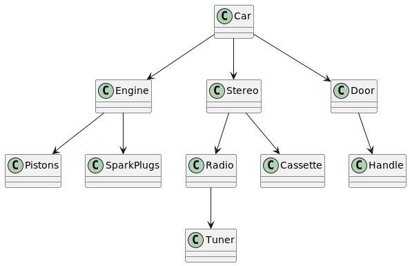

# Building Objects and Object-Oriented Design

There is a major difference between inheritance and composition. Although they allow us to have a relationship between a child and a parent, the two are inherently not the same.

Although it is true that inheritance is a relationship between two classes, what is really happening is that a parent is created that incorporates the attributes and methods of a child class.However, composition is a different situation. Composition represents interactions between distinct objects.

This chapter focuses on how composition is different from inheritance.

## Composition Relationships

We have already seen that composition represents a part of a whole. Although the inheritance relationship is stated in terms of is-a, composition is stated in terms of has-a. We know intuitively that a car “has-a” steering wheel.

The reason to use composition is that it builds systems by combining less complex parts. This is a common way for people to approach problems. Studies show that even the best of us can keep, at most, seven chunks of data in our short-term memory at one time. Thus, we like to use abstract concepts. Instead of saying that we have a large unit with a steering wheel, four tires, an engine, and so on, we say that we have a car. This makes it easier for us to communicate and keep things clear in our heads.

Composition also helps in other ways, such as making parts interchangeable. If all steering wheels are the same, it does not matter which specific steering wheel is installed in a specific car. In software development, interchangeable parts mean **reuse**.

## Building In Phases

Another major advantage in using composition is that systems and subsystems can be built independently, and perhaps more importantly, tested and maintained independently.

To build quality software, you must follow one overriding rule to be successful: Keep things as simple as possible. For large software systems to work properly and be easily maintained, they must be broken into smaller, more manageable parts.

**The architecture of complexity, by Nobel Prize winner Herbert Simon, states that:**

1. Stable complex systems usually take the form of a hierarchy, where each system is built from simpler subsystems, and each subsystem is built from simpler subsystems still.
2. Stable, complex systems are nearly decomposable. Meaning you can identify the parts that make up the system and can tell the difference between interactions between the parts and inside the parts.
3. Stable complex systems are almost always composed of only a few different kinds of subsystems, arranged in different combinations.
4. Stable systems that work have almost always evolved from simple systems
   that worked.

The above is 4 rules of building complex systems, and composition is just these 4 rules. Here is an analogy.

Let's say we have a stereo system. Suppose the stereo system was totally integrated and was not built from components (that is, the stereo system was one big black-box system). In this case, what would happen if the CD player broke and became unusable? You would have to take in the entire system for repair, or if not reparable throw it away. Not only would this be more complicated and expensive, but you would not have the use of any of the other components.

Suppose the system is broken into components rather than a single unit and connected together with wires. In this case, if the CD player broke, you could disconnect the CD player and take it in for repair. (Note that all the components are connected by wires, it's just a matter of connecting and disconnecting).

The above illustration shows clearly that composition is one of the primary strategies that you, as a software designer, have in your arsenal to fight software complexity.

## Types Of Composition

Generally, there are two types of composition: association and aggregation. In both cases, these relationships represent collaborations between the objects. The stereo example we just used to explain one of the primary advantages of composition represents an association.

All forms of composition include a has-a relationship. However, subtle differences exist between associations and aggregations based on how you visualize the parts of the whole. In an aggregation, you normally see only the whole, and in associations, you normally see the parts that make up the whole.

### Aggregation

Aggregation means that a complex object is composed of other objects. 

Let's see an analogy, when you go to buy a car, you do not pick and choose all the individual components of the car. You do not decide which spark plugs to buy or which door handles to buy. You go to buy a car. You choose the car as a whole, a complex object made up of many other complex and simple objects.

